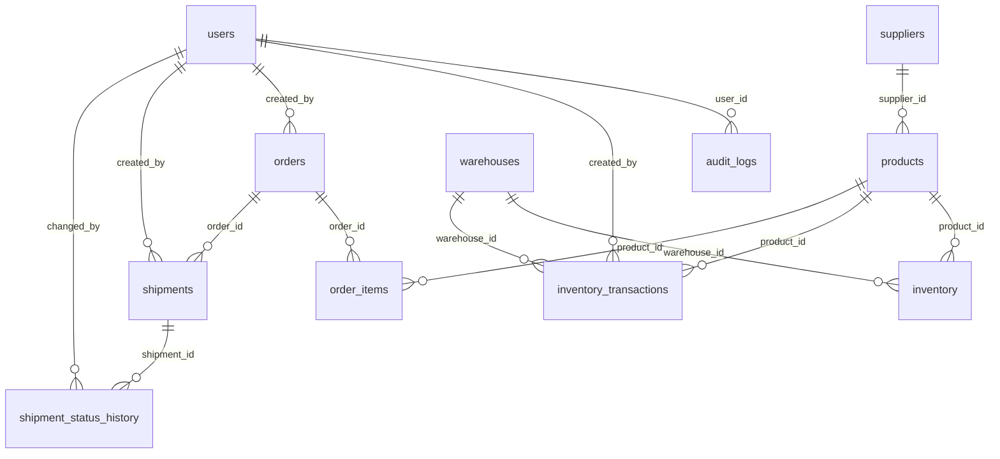

# ERD — Supply Chain Tracking & Analytics

## Overview



## Legenda

PK = primary key · UNIQUE = unique constraint · NN = NOT NULL · FK = foreign
key (all `ON DELETE RESTRICT`, none cascade). A diamond `>—` reads as
"one … references exactly one …", `<` as "one has many".

## Cardinality summary

```
USER (1) —< (N) ORDERS                      created_by
USER (1) —< (N) SHIPMENTS                   created_by
USER (1) —< (N) INVENTORY_TRANSACTIONS      created_by
USER (1) —< (N) SHIPMENT_STATUS_HISTORY     changed_by
USER (1) —< (N) AUDIT_LOGS                  user_id

SUPPLIER (1) —< (N) PRODUCTS                supplier_id
PRODUCT (1) —< (N) INVENTORY >— (1) WAREHOUSE
PRODUCT (1) —< (N) INVENTORY_TRANSACTIONS >— (1) WAREHOUSE
PRODUCT (1) —< (N) ORDER_ITEMS
ORDER (1) —< (N) ORDER_ITEMS
ORDER (1) —< (N) SHIPMENTS
SHIPMENT (1) —< (N) SHIPMENT_STATUS_HISTORY

ALERT     entity_type(entity,entity_id) → product | shipment    (polymorphic)
AUDIT_LOG entity_type(entity,entity_id) → any operational entity (polymorphic)
```

## Entity attributes

### users
`id` PK, NN · `name` NN · `email` NN **UNIQUE** · `password_hash` NN ·
`role` ENUM NN · `is_active` NN · `created_at` NN · `updated_at` NN

### suppliers
`id` PK, NN · `name` NN · `code` NN **UNIQUE** · `contact_name` ·
`email` · `phone` · `address` · `is_active` NN · `created_at` NN · `updated_at` NN

### products
`id` PK, NN · `supplier_id` **FK→suppliers.id** NN · `sku` NN **UNIQUE** ·
`name` NN · `description` · `unit` NN · `reorder_threshold` NN **CHECK ≥ 0** ·
`is_active` NN · `created_at` NN · `updated_at` NN

### warehouses
`id` PK, NN · `code` NN **UNIQUE** · `name` NN · `address` · `is_active` NN ·
`created_at` NN · `updated_at` NN

### inventory
`id` PK, NN · `product_id` **FK→products.id** NN · `warehouse_id`
**FK→warehouses.id** NN · `quantity` NN **CHECK ≥ 0** · `updated_at` NN ·
**UNIQUE(product_id, warehouse_id)**

### inventory_transactions (append-only)
`id` PK, NN · `product_id` **FK→products.id** NN · `warehouse_id`
**FK→warehouses.id** NN · `type` ENUM NN · `quantity` NN **CHECK ≠ 0** ·
`reference_type` · `reference_id` · `created_by` **FK→users.id** NN ·
`created_at` NN

### orders
`id` PK, NN · `order_number` NN **UNIQUE** · `status` ENUM NN ·
`created_by` **FK→users.id** NN · `created_at` NN · `updated_at` NN

### order_items
`id` PK, NN · `order_id` **FK→orders.id** NN · `product_id` **FK→products.id** NN ·
`quantity` NN **CHECK > 0** · **UNIQUE(order_id, product_id)**

### shipments
`id` PK, NN · `shipment_number` NN **UNIQUE** · `order_id` **FK→orders.id** NN ·
`status` ENUM NN · `expected_delivery_at` · `actual_delivery_at` ·
`created_by` **FK→users.id** NN · `created_at` NN · `updated_at` NN

### shipment_status_history (append-only)
`id` PK, NN · `shipment_id` **FK→shipments.id** NN · `status` ENUM NN ·
`changed_at` NN · `changed_by` **FK→users.id** NN

### alerts
`id` PK, NN · `type` ENUM NN · `severity` ENUM NN · `entity_type` NN ·
`entity_id` NN · `message` NN · `is_resolved` NN · `created_at` NN · `resolved_at`

### audit_logs
`id` PK, NN · `user_id` **FK→users.id** NN · `action` NN · `entity_type` NN ·
`entity_id` NN · `old_value` JSON · `new_value` JSON · `created_at` NN

## Design notes that the ERD makes visible

1. **Inventory is the only junction between product and warehouse** — one row
   per (product, warehouse) enforced by the composite UNIQUE.
2. **Shipment history is a child of shipments only** — it never belongs to the
   product or the order.
3. **Alerts/audit_logs carry polymorphic references** — they deliberately have
   no FK to a single table; entity integrity is guaranteed by the service layer
   that writes them.
4. **No survival of operational history through cascade deletes** — every FK is
   RESTRICT; master data is soft-deactivated via `is_active`.